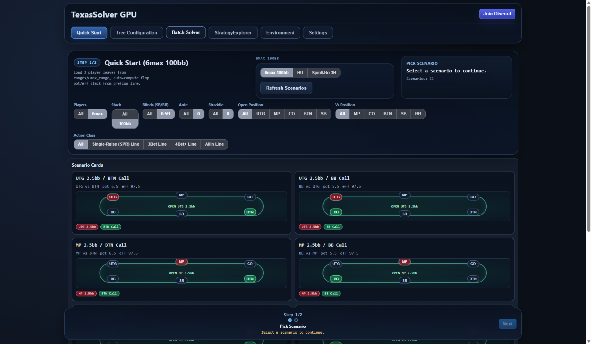
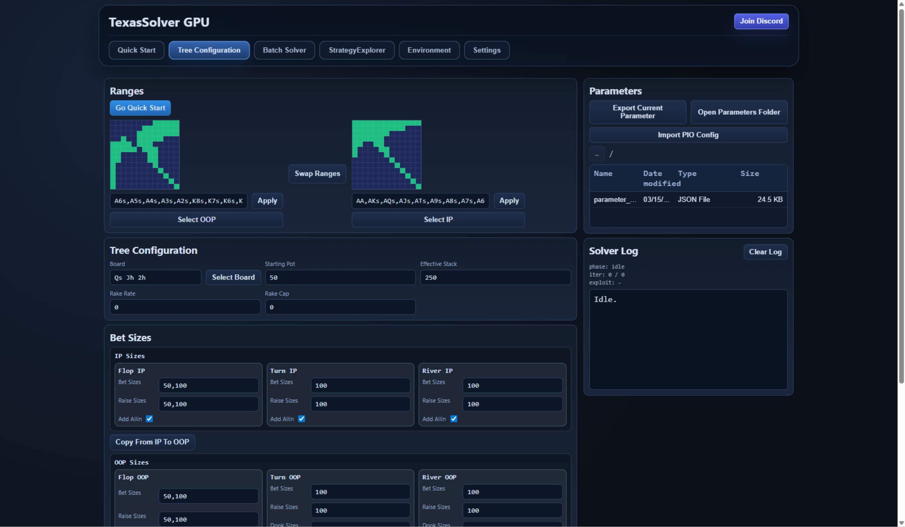
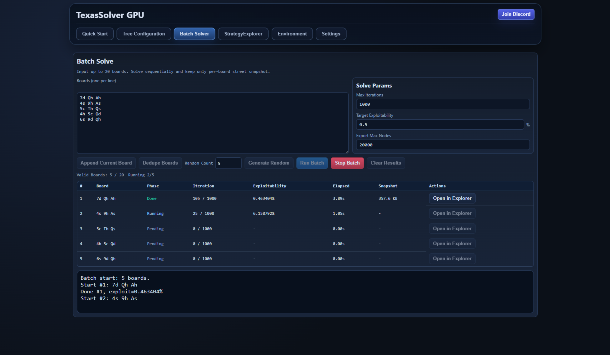
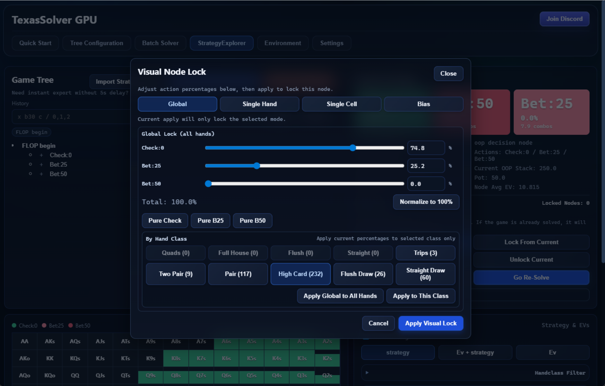
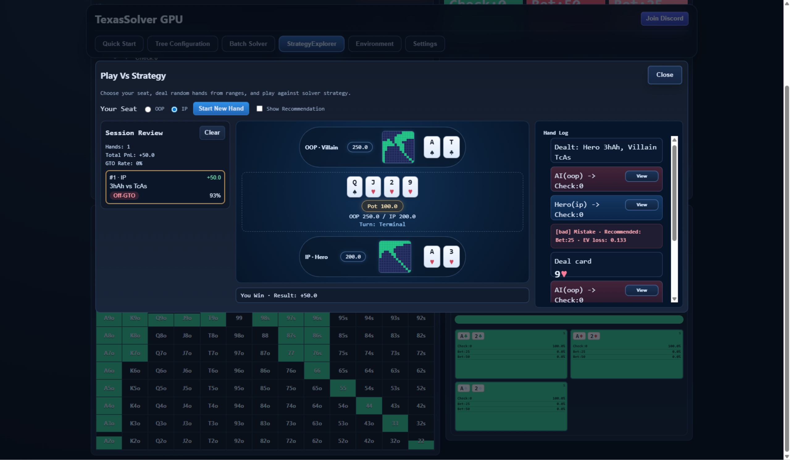

# TexasSolver GPU

[](https://github.com/bupticybee/TexasSolverGPU/releases)
[](./EULA.md)
[](https://discord.com/invite/RtyD4vRy2e)

[English](./README.md) | [简体中文](./README.zh-CN.md) | [日本語](./README.ja-JP.md) | README 한국어 | [Español](./README.es-ES.md) | [Русский](./README.ru-RU.md)

<p align="center">
  
</p>

TexasSolver GPU는 기존의 CPU 중심 솔버 워크플로보다 훨씬 빠른 로컬 솔빙을 목표로 하는 GPU 가속 텍사스 홀덤 솔버의 Windows 공개 배포 저장소입니다.

## 소개

TexasSolver GPU는 NVIDIA GPU가 있는 Windows 환경에서 로컬 분석을 수행하기 위해 만들어졌습니다. 기존 TexasSolver 계열의 CPU 중심 분석 흐름과 비교해, 이 GPU 데스크톱 런타임은 더 빠른 솔빙과 더 빠른 반복 작업을 지향합니다. 데스크톱 앱에는 네이티브 solver runtime과 GUI가 함께 포함되어 있어 다음과 같은 작업을 할 수 있습니다.

- 트리 구성 및 빠른 시작 분석
- 여러 보드에 대한 배치 솔브
- 노드 락 시나리오 분석
- 전략 결과 탐색 및 연습

이 저장소는 공개 배포용이며, 비공개 `gpu_solver` 메인 소스는 포함하지 않습니다.

## 왜 GPU인가

- GPU 가속은 많은 로컬 솔빙 작업에서 시간을 크게 줄여 줍니다.
- 더 빠른 반복 속도 덕분에 트리 구성, 배치 솔브, 노드 락 실험이 훨씬 실용적입니다.
- NVIDIA GPU를 사용하는 Windows 유저에게 이 프로젝트는 기존 TexasSolver 계열을 고성능으로 확장한 버전입니다.

## 스크린샷

### Quick Start



### Tree Construction



### Batch Solving



### Node Lock



### Play Against Strategy



## 다운로드

Windows 빌드는 [GitHub Releases](https://github.com/bupticybee/TexasSolverGPU/releases)에서 다운로드하세요.

현재 공개 릴리스:

- 버전: `v0.2.0`
- 플랫폼: `windows-x64`

## 포함 파일

각 Windows 번들에는 다음이 포함됩니다.

- `TexasSolverGpu.exe`
- `TexasSolverGpu_131.exe`
- `TexasSolverGpu_legacy_126.exe`
- `WebView2Loader.dll`
- `quick_start/`
- `ranges/`

권장 실행 순서:

1. `TexasSolverGpu.exe`
2. `TexasSolverGpu_131.exe`
3. `TexasSolverGpu_legacy_126.exe`

## 요구 사항

- Windows 10 / Windows 11 64-bit
- NVIDIA GPU
- WebView2 Runtime 설치

## Viewer

전략 뷰어는 [viewer/viewer.py](./viewer/viewer.py)에 Python 소스로 제공됩니다.

```powershell
python viewer/viewer.py --file your_result.json
```

자세한 내용은 [viewer/README.md](./viewer/README.md)를 참고하세요.

## 커뮤니티

- Discord: https://discord.com/invite/RtyD4vRy2e

## 안내

- 공개 저장소라고 해서 비공개 `gpu_solver` 메인 소스가 오픈소스가 되는 것은 아닙니다.
- 이 저장소는 바이너리 배포, 메타데이터, 스크린샷, 보조 도구 전용입니다.
- 내부 solver 구현, 빌드 시스템, 비공개 도구는 공개되지 않습니다.
- 배포 관련 안내는 [EULA.md](./EULA.md)를 확인하세요.
