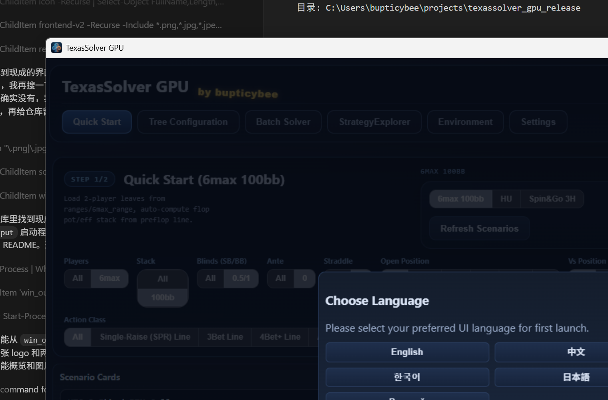
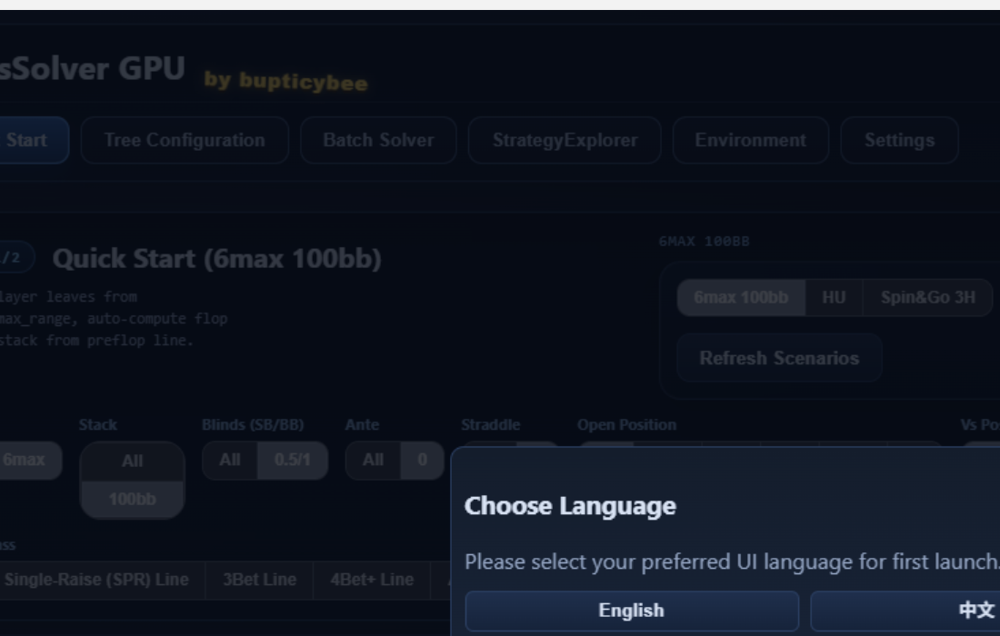
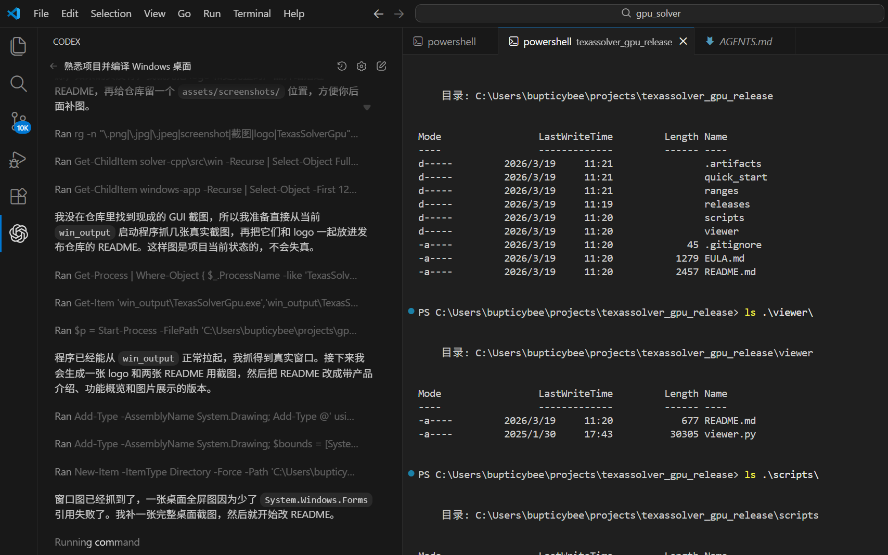

# TexasSolver GPU

<p align="center">
  
</p>

<p align="center">
  Windows desktop release repository for a GPU-accelerated Texas Hold'em solver.
</p>

## Overview

TexasSolver GPU is a Windows desktop solver focused on practical local analysis for No-Limit Texas Hold'em. The application packages a native C++/CUDA solver runtime together with a desktop GUI, so users can run studies locally on a Windows machine with an NVIDIA GPU.

This repository is the public release and distribution repository. It is not the main development repository and it does not contain the private `gpu_solver` source tree.

This repo is intended to host:

- release documentation and release metadata
- GitHub Release assets for Windows builds
- the public `viewer` utility
- static public assets such as `quick_start` and `ranges`
- scripts that assemble release bundles from a local `gpu_solver` checkout

## What The Project Includes

- Windows desktop launcher with bundled solver runtimes
- GPU-oriented solver workflow for local study
- built-in quick start datasets and preflop range assets
- Python strategy viewer for exported JSON results

## Screenshots

### Main Window



### Solver Workspace Detail



### Desktop View



## Download

Official Windows binaries should be downloaded from GitHub Releases for this repository.

Current local release metadata in this repo points to:

- Version: `v0.1.0`
- Platform: `windows-x64`

## System Requirements

- Windows 10 or Windows 11, 64-bit
- NVIDIA GPU
- WebView2 Runtime installed on the target machine

## Release Bundle Contents

Each Windows release bundle is expected to include:

- `TexasSolverGpu.exe`
- `TexasSolverGpu_131.exe`
- `TexasSolverGpu_legacy_126.exe`
- `WebView2Loader.dll`
- `quick_start/`
- `ranges/`

Recommended startup order:

1. `TexasSolverGpu.exe`
2. `TexasSolverGpu_131.exe`
3. `TexasSolverGpu_legacy_126.exe`

## Viewer

The viewer is distributed as Python source in [viewer/viewer.py](viewer/viewer.py).

Run it with:

```powershell
python viewer/viewer.py --file your_result.json
```

See [viewer/README.md](viewer/README.md) for dependencies and usage notes.

## Repository Policy

- Public repo does not mean the private `gpu_solver` source code is open source.
- This repo is for binary distribution, metadata, and helper tools only.
- Internal solver implementation, training code, build code, and private tooling are not published here.
- Feature development should happen in the private source repository, not here.

## Release Workflow

This repo stores metadata and helper content. Large release artifacts should go to GitHub Releases, not git history.

Typical local workflow:

```powershell
cd scripts
.\prepare_release.ps1 -Version v0.1.0
```

That script expects a sibling checkout at `../gpu_solver`, validates `win_output`, builds a clean staging directory, creates a zip bundle, and updates:

- `releases/latest/manifest.json`
- `releases/latest/checksums.txt`
- `releases/latest/release_notes.md`
